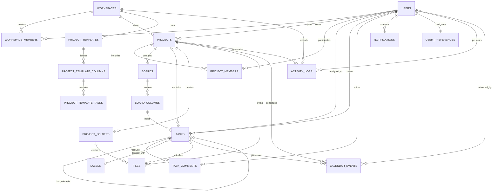

# HIVE Entity Relationships

## 1. Purpose

This document describes how the main entities in HIVE relate to one another.

HIVE is structured around a simple operational hierarchy:

```text
Workspace
└── Projects
    ├── Members
    ├── Board
    │   ├── Columns
    │   └── Tasks
    │       ├── Subtasks
    │       ├── Assignees
    │       ├── Labels
    │       ├── Comments
    │       └── Files
    ├── Calendar Events
    ├── Files and Folders
    └── Activity
```

---

## 2. High-Level Entity Map



---

## 3. Relationship Summary

| Parent Entity | Child Entity | Cardinality | Description |
|---|---|---:|---|
| Workspace | Workspace Members | 1:M | A workspace contains many user memberships |
| User | Workspace Members | 1:M | A user may belong to one or more workspaces |
| Workspace | Projects | 1:M | A workspace contains many projects |
| User | Projects | 1:M | A user can own many projects |
| Project | Project Members | 1:M | A project contains multiple team members |
| User | Project Members | 1:M | A user can participate in many projects |
| Project | Boards | 1:M | A project may contain one or more boards |
| Board | Board Columns | 1:M | A board contains ordered Kanban columns |
| Project | Tasks | 1:M | A project contains many tasks |
| Board Column | Tasks | 1:M | A column holds many tasks |
| Task | Task | 1:M | A task may contain multiple subtasks |
| User | Tasks | 1:M | A user may own or be assigned many tasks |
| Task | Comments | 1:M | A task may contain many comments |
| Task | Labels | M:M | A task may have many labels |
| Project | Folders | 1:M | A project may contain many folders |
| Folder | Files | 1:M | A folder may contain many files |
| Task | Files | 1:M | A task may have many attachments |
| Project | Calendar Events | 1:M | A project may have many calendar events |
| Calendar Event | Users | M:M | An event may have multiple attendees |
| User | Notifications | 1:M | A user receives many notifications |
| User | Preferences | 1:1 | A user has one preference record |
| Workspace | Templates | 1:M | A workspace owns many templates |
| Template | Template Columns | 1:M | A template defines Kanban columns |
| Template Column | Template Tasks | 1:M | A template column contains default tasks |
| Workspace | Activity Logs | 1:M | A workspace records many activities |

---

## 4. Core Relationship Rules

## 4.1 Users, Workspaces, and Membership

### Relationship

```text
users
  1
  │
  └──< workspace_members >──┐
                            │
                            1
                       workspaces
```

A user is not stored directly inside a workspace. The `workspace_members` table handles:

- Membership
- Role
- Invitation history
- Active or inactive state

This allows HIVE to support one HIMARK workspace now without hard-coding that assumption.

### Key rules

- A user may only have one active membership per workspace.
- Each workspace must have at least one owner.
- An owner cannot be removed until another owner is assigned.
- Deactivated users retain historical ownership references.

---

## 4.2 Workspaces and Projects

### Relationship

```text
workspace 1 ────< projects
```

Every project belongs to exactly one workspace.

A project stores:

- Workspace
- Owner
- Status
- Dates
- Progress
- Optional template source

### Key rules

- Project codes must be unique.
- Project owners must be active workspace members.
- Archived projects remain readable but are excluded from active views.
- Project progress is derived from task completion or explicitly recalculated.

---

## 4.3 Projects and Project Members

### Relationship

```text
projects
  1
  │
  └──< project_members >── users
```

Project members control project-specific access.

Workspace membership alone does not automatically mean every user can edit every project.

### Roles

```text
project_owner
project_manager
contributor
viewer
```

### Key rules

- Every project must have at least one `project_owner`.
- The project `owner_id` should match one active project owner.
- Contributors may update tasks but not project configuration.
- Viewers may only read project content.

---

## 4.4 Projects, Boards, and Columns

### Relationship

```text
project 1 ────< boards 1 ────< board_columns
```

Each project should have one default board.

The board contains ordered columns such as:

```text
Backlog
To Do
In Progress
Review
Done
```

### Key rules

- A board must contain at least one active column.
- One or more columns may represent terminal completion states.
- Column positions must be unique within a board.
- Deleting a column is blocked until its tasks are moved.

---

## 4.5 Projects, Tasks, and Board Columns

### Relationship

```text
project 1 ────< tasks >──── 1 board_column
```

Each task belongs to:

- One project
- One board
- One current column

The board column determines the task's operational status.

### Why status is not duplicated

HIVE should not independently store both:

```text
task.status
task.column_id
```

That creates drift.

Instead:

```text
tasks.column_id
        ↓
board_columns.status_type
```

The column is the source of truth.

### Key rules

- The selected column must belong to the task's board.
- The board must belong to the task's project.
- Moving a task changes `column_id` and `position`.
- Moving a task into a terminal column sets `completed_at`.
- Moving a completed task out of a terminal column clears `completed_at`.

---

## 4.6 Tasks and Subtasks

### Relationship

```text
task 1 ────< subtasks
```

Subtasks are stored in the same `tasks` table using `parent_task_id`.

### Example

```text
Build homepage
├── Create wireframe
├── Write copy
├── Implement layout
└── Complete QA
```

### Key rules

- Parent and child tasks must belong to the same project.
- Circular parent-child relationships are prohibited.
- A task should not be nested more than one or two levels.
- Parent progress may be calculated from child completion.

Recommended rule:

```text
parent progress =
completed direct subtasks / total direct subtasks × 100
```

---

## 4.7 Tasks and Assignees

### Primary ownership

```text
tasks.assignee_id → users.id
```

This identifies the person accountable for completing the task.

### Optional collaborators

```text
tasks
  1
  │
  └──< task_assignees >── users
```

Use the many-to-many table only when multiple collaborators are genuinely required.

### Key rule

Do not remove the concept of a single accountable owner. Multiple assignees without clear ownership create ambiguity.

---

## 4.8 Tasks and Labels

### Relationship

```text
tasks >──< task_labels >──< labels
```

Labels are reusable within a workspace.

Examples:

```text
Blocked
Client Input
Design
Development
Internal
High Attention
```

### Key rules

- Labels must belong to the same workspace as the task's project.
- Duplicate label names are not allowed within a workspace.
- Labels should use predefined design tokens rather than arbitrary hex values.

---

## 4.9 Tasks and Comments

### Relationship

```text
task 1 ────< task_comments
user 1 ────< task_comments
```

A task can contain many comments, each authored by one user.

Replies use `parent_comment_id`.

### Mentions

```text
task_comments >──< comment_mentions >── users
```

A mention generates a notification for the mentioned user.

### Key rules

- Only project members may comment.
- Edited comments retain their original creation time.
- Deleted comments should be soft deleted when they form part of a thread.

---

## 4.10 Projects, Folders, and Files

### Relationship

```text
project 1 ────< project_folders
project_folder 1 ────< files
project 1 ────< files
task 1 ────< files
```

Files may be:

- Stored in a project folder
- Attached directly to a task
- Associated with a project without a folder

### Folder hierarchy

```text
Project Files
├── Project Plans
├── Meeting Notes
├── Designs
├── Deliverables
└── Assets
```

Folders use `parent_folder_id` for nesting.

### Key rules

- A file's folder must belong to the same project.
- A task attachment must belong to the same project as the task.
- File binaries are stored in object storage.
- PostgreSQL stores metadata and access relationships.
- Folder nesting should be limited to avoid unnecessary complexity.

---

## 4.11 Projects, Tasks, and Calendar Events

### Relationship

```text
project 1 ────< calendar_events
task 0..1 ────< calendar_events
```

An event may relate to a project, a task, or both.

Examples:

```text
Project kickoff
Task deadline
Milestone review
Team meeting
Reminder
```

### Key rules

- A task deadline may generate a calendar event.
- Deleting a calendar event does not delete the task.
- Updating a task due date should update its generated deadline event.
- Personal events may have no project.

---

## 4.12 Calendar Events and Attendees

### Relationship

```text
calendar_events >──< calendar_event_attendees >── users
```

An event can have many attendees, and a user can attend many events.

### RSVP values

```text
pending
accepted
declined
tentative
```

### Key rules

- The event creator does not need a separate attendee row unless RSVP behaviour is required.
- Only active workspace members may be internal attendees.
- External attendees should be handled separately if introduced later.

---

## 4.13 Users and Notifications

### Relationship

```text
user 1 ────< notifications
```

Each notification belongs to one user.

Notifications reference related records through:

```text
entity_type
entity_id
```

Example:

```text
entity_type = task
entity_id = 7f...
```

### Key rules

- Notifications are user-specific.
- Deleting the related entity should not break notification rendering.
- The notification should preserve enough text to remain understandable.
- Read state is independent per user.

---

## 4.14 Users and Preferences

### Relationship

```text
user 1 ──── 1 user_preferences
```

Each user has one current preference record.

Notification preferences are separated because each notification type has multiple channel settings.

```text
user 1 ────< notification_preferences
```

### Key rules

- Preferences are created automatically when a user joins.
- Missing preference values should fall back to workspace defaults.
- User settings override workspace defaults where permitted.

---

## 4.15 Project Templates and Projects

### Relationship

```text
project_template 0..1 ────< projects
```

A project may be created from a template.

The project stores `template_id` only for traceability. It must not remain dynamically linked to the template.

### Why templates are copied

When a project is created from a template:

1. Create the project.
2. Create the project board.
3. Copy template columns into board columns.
4. Copy template tasks into tasks.
5. Resolve parent-child task references.
6. Calculate due dates from `due_offset_days`.

Future changes to the template must not modify existing projects.

---

## 4.16 Project Templates, Columns, and Tasks

### Relationship

```text
project_templates
  1
  │
  ├──< project_template_columns
  │        1
  │        └──< project_template_tasks
  │
  └──< project_template_tasks
```

Template tasks belong to both:

- A template
- A template column

They may also have parent template tasks.

### Example

```text
Website Development Template
├── Backlog
│   ├── Gather requirements
│   └── Collect brand assets
├── To Do
│   └── Create sitemap
├── In Progress
├── Review
└── Done
```

---

## 4.17 Activity Logs

### Relationship

```text
workspace 1 ────< activity_logs
project 0..1 ────< activity_logs
user 0..1 ────< activity_logs
```

Activity logs provide the project and workspace activity feeds.

Examples:

```text
project_created
task_created
task_moved
task_assigned
task_completed
comment_added
file_uploaded
member_added
template_used
```

### Metadata example

```json
{
  "previous_column": "To Do",
  "new_column": "In Progress",
  "task_title": "Build homepage"
}
```

### Key rules

- Activity logs are append-only.
- Application users do not edit activity records.
- Sensitive information must not be stored in metadata.
- Logs should remain after the referenced record is archived.

---

## 5. Aggregate Roots

For implementation, treat the following as primary aggregate roots.

## 5.1 Workspace aggregate

```text
Workspace
├── Workspace Members
├── Labels
├── Templates
└── Workspace Settings
```

## 5.2 Project aggregate

```text
Project
├── Project Members
├── Board
│   ├── Columns
│   └── Tasks
├── Folders
├── Files
├── Calendar Events
└── Activity Logs
```

## 5.3 Task aggregate

```text
Task
├── Subtasks
├── Assignees
├── Labels
├── Comments
├── Mentions
└── Attachments
```

Changes to child entities should validate against the aggregate root.

---

## 6. Ownership and Access Matrix

| Entity | Owner/Admin | Project Manager | Contributor | Viewer |
|---|---:|---:|---:|---:|
| Workspace settings | Manage | No | No | No |
| Team membership | Manage | No | No | No |
| Project settings | Manage | Manage assigned projects | No | View |
| Board columns | Manage | Manage | No | View |
| Tasks | Manage | Manage | Create/update | View |
| Comments | Manage | Create/update | Create/update | Optional |
| Files | Manage | Manage | Upload/update | View |
| Calendar events | Manage | Manage | Create/update assigned project | View |
| Templates | Manage | Optional | No | View |
| Activity logs | View | View | View | View |

---

## 7. Lifecycle Relationships

## 7.1 Project lifecycle

```text
not_started
    ↓
active
    ↓
on_hold
    ↓
active
    ↓
completed
    ↓
archived
```

A project may be archived from any non-deleted state by an authorised user.

## 7.2 Task lifecycle

```text
Backlog
  ↓
To Do
  ↓
In Progress
  ↓
Review
  ↓
Done
```

Tasks may move backwards where rework is required.

## 7.3 File lifecycle

```text
Uploaded
  ↓
Updated / Replaced
  ↓
Archived or Soft Deleted
```

## 7.4 Membership lifecycle

```text
Invited
  ↓
Active
  ↓
Inactive
  ↓
Removed
```

---

## 8. Referential Integrity Rules

The database and application must enforce:

1. Every project belongs to an existing workspace.
2. Every project owner is an active workspace member.
3. Every task belongs to an existing project.
4. Every task column belongs to the same project board.
5. Every project member is also a workspace member.
6. Every label belongs to the same workspace as the task.
7. Every folder belongs to the same project as its files.
8. Every task attachment belongs to the same project as the task.
9. Every calendar attendee is an active user.
10. Every template task belongs to a column from the same template.
11. Parent tasks and subtasks belong to the same project.
12. Parent comments and replies belong to the same task.

---

## 9. MVP Relationship Scope

The MVP should prioritise these relationships:

```text
Workspace ↔ Users
Workspace → Projects
Projects ↔ Users
Projects → Boards
Boards → Columns
Projects → Tasks
Columns → Tasks
Tasks → Comments
Tasks ↔ Labels
Projects → Files
Tasks → Files
Projects → Calendar Events
Calendar Events ↔ Users
Users → Notifications
Workspace → Project Templates
Templates → Template Columns
Template Columns → Template Tasks
```

Defer these unless required immediately:

```text
Multiple task assignees
Nested comment threads
Advanced file versions
External calendar attendees
Multiple boards per project
Deep folder nesting
```

---

## 10. Design Principle

HIVE's data model should remain subordinate to its product goal:

> Help the HIMARK team create projects, organise tasks, move work across a board, meet deadlines, and find project files.

Do not add entities merely because they are common in enterprise project-management systems. Every table should support a workflow the HIMARK team will actually use.
